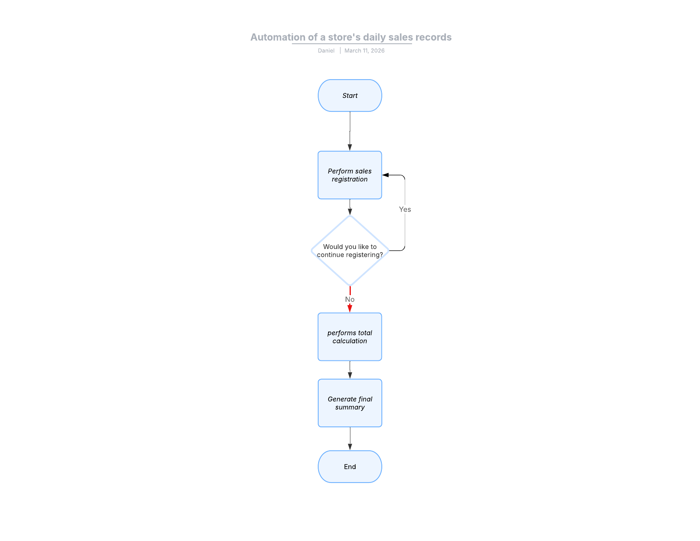

# Sales Registration Automation System

This project is a python program that automates the registration of a sales for store.
the system allows the user to register products, price and quatities purchased and finaly generate a summary of a daily sales 

## Objective

Simplify the process of recording sales and provide a clear summmary about the day 

## Features
 + Register product sales
 + Generate a summary of all daily sales

## Program Structure 
 - main.py -> control the program flow 
 - services.py -> contains all functions for the correct sales register 
 - validations.py -> contains all validations for each input

## How the Program Works 

1. The progrm receives product information (name, price, quantity)
2. The product information is stored in a dictionaries and list 
3. The program calculate all sales about each product stored 
4. It generates a summary of daily sales 

## How to Run the Project 

```bash 
python main.py 
```

 

